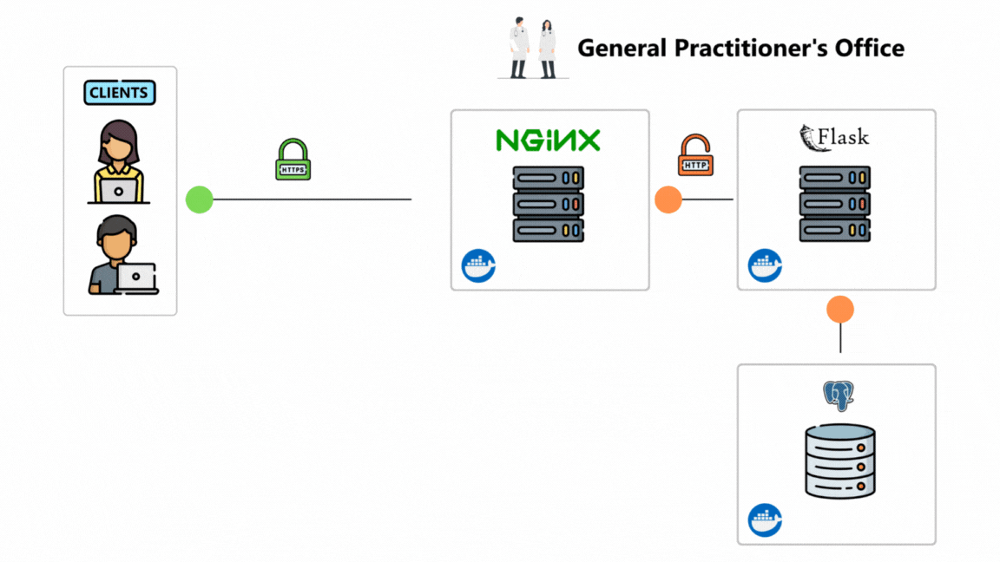

# simple-vulnerable-app 
Simple containerized vulnerable web app written in Flask. 

For example, you can test a cross-site scripting attack.

The app is designed to help general practitioners to manage their patients, patients prescriptions, and medicine.

The application is called ***"GP-Office"***, which stands for ***"General Pratictioner's Office"***.

Some features of the application are listed below:
- **Patient management:** General practitioners can add details about their patients, such as name, surname, fiscal code or phone number.
- **Medical prescription management:** For each patient, prescriptions can be entered, specifying the relevant medicine and quantity.
- **Medicine management:** General practitioners can add, update or delete medicines.

## Used technologies
- **Flask:** Lightweight micro web framework written in Python.
- **Docker:** Tool that is used to automate the deployment of applications in lightweight containers so that applications can work efficiently in different environments in isolation.
- **Docker Compose:** Tool for defining and running multi-container applications.

## Project structure


## Requirements
- [Docker](https://www.docker.com/)
- Modern web browser

## Installation
``` bash
git clone https://github.com/carmine-ambrosino/simple-vulnerable-app.git
cd simple-vulnerable-app

# Production Mode
docker compose up -d
```
> **Note:** If you want to modify this sorce code, you can use the following command to enter in development mode:
``` bash
# Development Mode
docker compose -f docker-compose-dev.yml up -d
```

## App access
### Production Mode
The application will be accessible from your browser at:
- https://localhost

### Development mode
The application will be accessible from your browser at:
- **Flask:** https://localhost:5000
- **Database:** Avaible on port 5432

## Use in Virtual Machine
This setup is specific for running locally; if you want to run it in a
virtual machine, modify the following file:
- ***nginx/nginx.conf*:** Change `server_name` with virtual machine ip address. 

## Note
Do not use in production environments as there may be errors or bugs. 
It is for demonstration purposes only to have an environment on which to test attack, like cross-site scripting.

